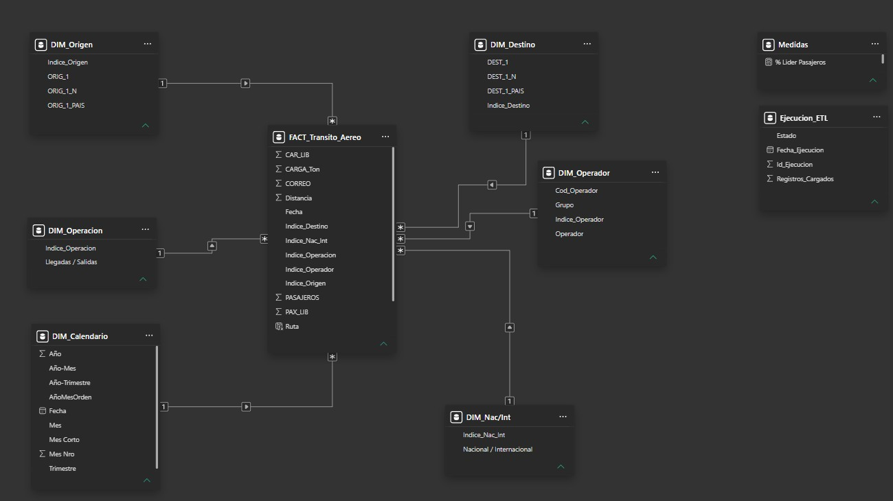
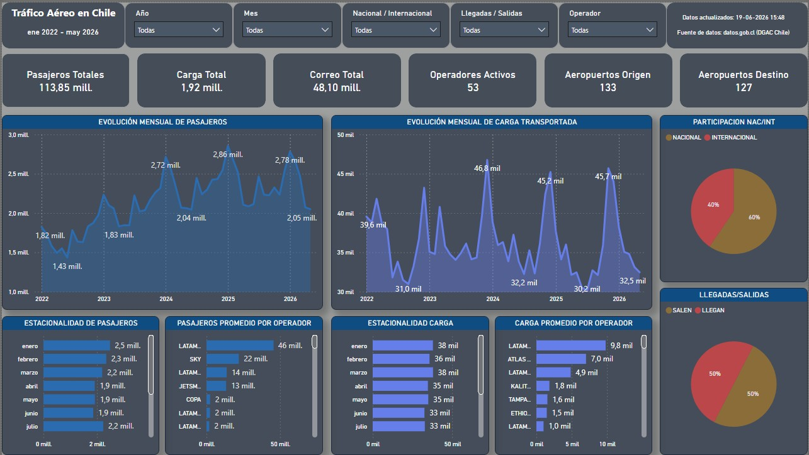
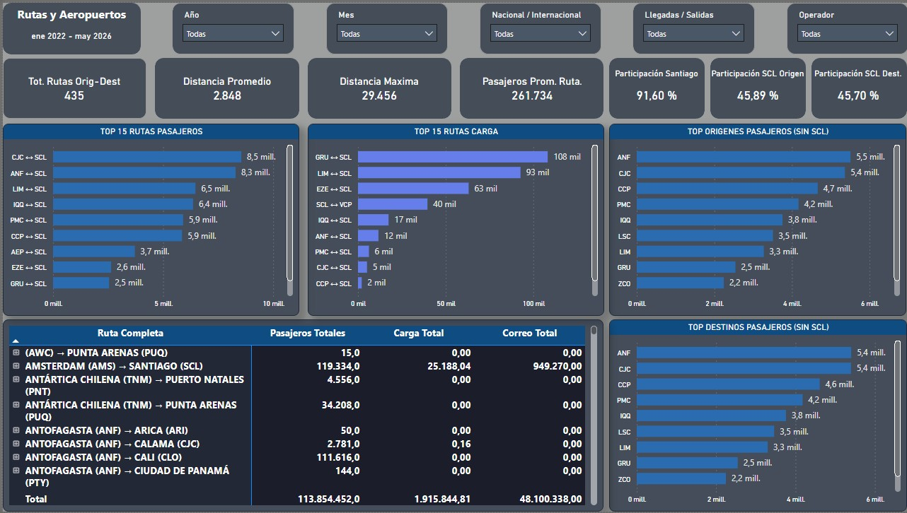
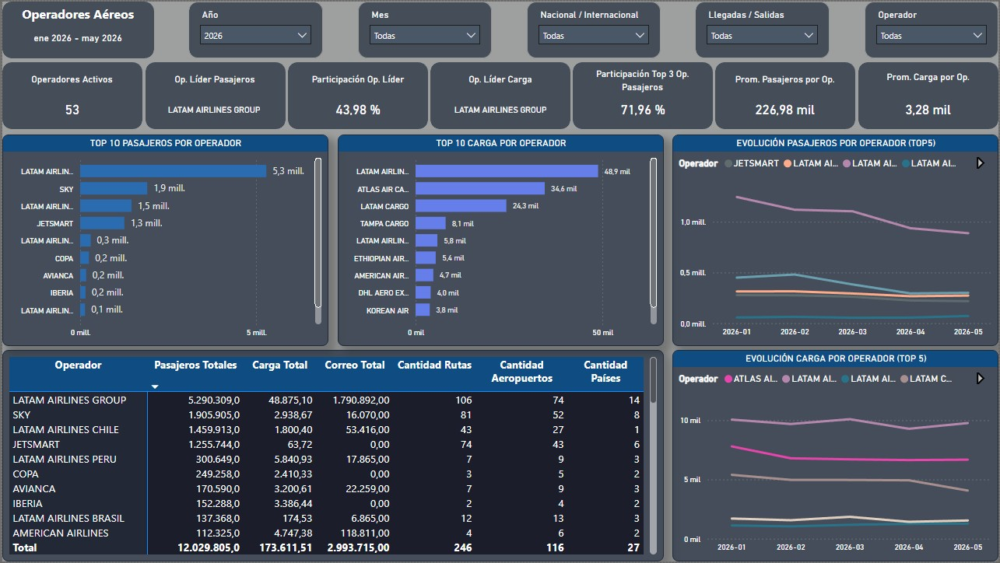

# Tráfico Aéreo en Chile (2022 - 2026)

## Descripción

Proyecto de Business Intelligence desarrollado para analizar el comportamiento del tráfico aéreo en Chile entre enero de 2022 y mayo de 2026.

La solución integra procesos ETL desarrollados en Python, almacenamiento en SQL Server y visualización interactiva en Power BI, permitiendo analizar pasajeros, carga, correo, rutas, aeropuertos y operadores aéreos desde una perspectiva estratégica y operacional.

Los datos fueron obtenidos desde la Dirección General de Aeronáutica Civil (DGAC Chile) a través del portal de datos abiertos del gobierno de Chile.

---

## Objetivos del Proyecto

* Analizar la evolución temporal del tráfico aéreo chileno.
* Identificar patrones de estacionalidad en pasajeros y carga.
* Evaluar la concentración operacional del Aeropuerto Arturo Merino Benítez (SCL).
* Identificar las principales rutas aéreas nacionales e internacionales.
* Analizar la participación de mercado de los operadores aéreos.
* Construir una solución de análisis reproducible utilizando Python, SQL Server y Power BI.

---

## Arquitectura de la Solución

```text
Datos DGAC Chile
       │
       ▼
Python ETL
(Extract - Transform - Load)
       │
       ▼
SQL Server
(Modelo Dimensional)
       │
       ▼
Power BI
(Dashboard e Insights)
```

---

## Tecnologías Utilizadas

### Lenguajes

* Python
* SQL
* DAX

### Librerías Python

* Pandas
* NumPy
* Requests
* SQLAlchemy
* PyODBC
* Python-Docx

### Herramientas

* SQL Server
* Power BI Desktop
* Visual Studio Code
* Git
* GitHub

---

## Modelo de Datos



El modelo fue construido utilizando una tabla de hechos central para movimientos aéreos y dimensiones para operadores, aeropuertos, rutas, tiempo y clasificación operacional.

---

# Dashboard Ejecutivo



Principales indicadores monitoreados:

* Pasajeros Totales
* Carga Transportada
* Correo Transportado
* Operadores Activos
* Aeropuertos de Origen y Destino
* Participación Nacional / Internacional
* Estacionalidad de Pasajeros
* Estacionalidad de Carga

---

# Rutas y Aeropuertos



Análisis enfocado en:

* Top rutas por pasajeros
* Top rutas por carga
* Principales aeropuertos de origen
* Principales aeropuertos de destino
* Cobertura operacional
* Distancias promedio y máximas
* Participación del Aeropuerto de Santiago

---

# Operadores Aéreos



Análisis enfocado en:

* Participación de mercado por operador
* Evolución temporal de pasajeros
* Evolución temporal de carga
* Cobertura de rutas
* Cobertura de aeropuertos
* Cobertura internacional por país
* Concentración de mercado

---

## Principales Hallazgos

* Santiago (SCL) concentra más del 90% de las rutas analizadas dentro del sistema.
* LATAM Airlines Group lidera el mercado de pasajeros con aproximadamente el 40% del tráfico total.
* Los tres principales operadores concentran más del 70% del tráfico de pasajeros.
* Las rutas Calama ↔ Santiago y Antofagasta ↔ Santiago destacan entre los corredores domésticos más relevantes.
* La distribución de carga aérea presenta patrones significativamente distintos a los observados en pasajeros.
* Existen operadores especializados en carga cuya participación es mucho más relevante en toneladas transportadas que en volumen de pasajeros.
* La red aérea chilena presenta una fuerte centralización en torno al Aeropuerto Arturo Merino Benítez (SCL).

---

## Habilidades Aplicadas

### Ingeniería de Datos

* Desarrollo de procesos ETL
* Automatización de cargas
* Integración de datos
* Validación y limpieza de información

### Modelado de Datos

* Modelo dimensional
* Tablas de hechos y dimensiones
* Relaciones y optimización de consultas

### Business Intelligence

* Diseño de dashboards ejecutivos
* Definición de KPIs
* Storytelling con datos
* Análisis exploratorio

### Power BI

* DAX
* Power Query
* Tooltips personalizados
* Interacciones entre visuales
* Diseño de experiencia de usuario (UX)

### SQL

* Modelado relacional
* Consultas analíticas
* Generación de estructuras de carga

---

## Estructura del Proyecto

```text
Trafico-Aereo-Chile
│
├── Documentacion
├── PowerBI
├── Python
│   ├── extract.py
│   ├── transform.py
│   ├── load.py
│   ├── profile_dataset.py
│   ├── generate_sql.py
│   ├── config.py
│   └── requirements.txt
│
├── SQL
├── imagenes
│
├── README.md
└── .gitignore
```

---

## Componentes ETL

### Extract

Obtención y consolidación de archivos fuente provenientes de la DGAC.

### Transform

Limpieza, homologación, enriquecimiento y preparación de datos para análisis.

### Load

Carga automatizada de datos hacia SQL Server.

### Data Profiling

Generación de métricas descriptivas para evaluar calidad y consistencia de la información.

---

## Autor

**Nelson Díaz**

Business Intelligence Analyst | Data Analyst | Power BI Developer

Santiago, Chile

Proyecto desarrollado con fines de análisis, aprendizaje y construcción de portafolio profesional.
